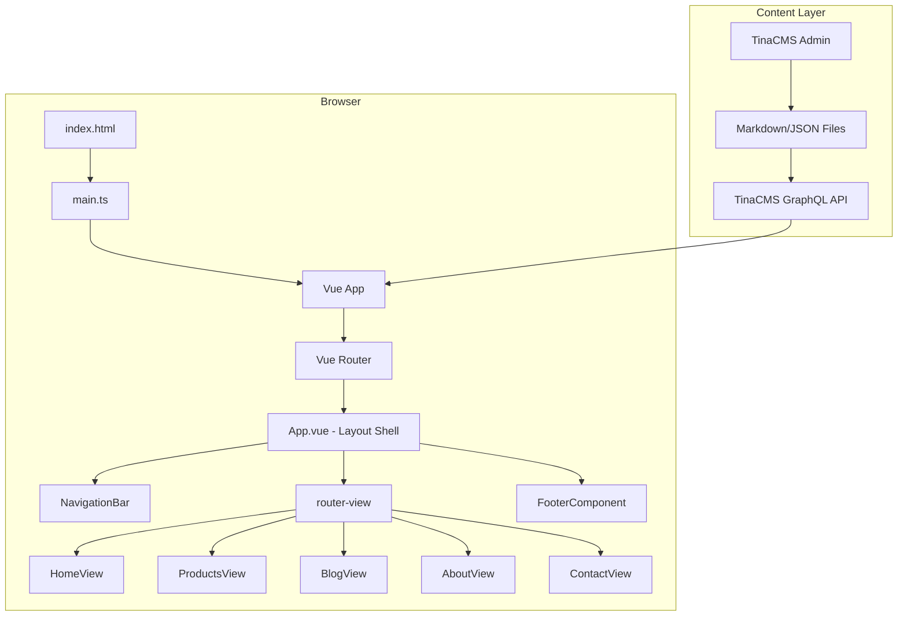
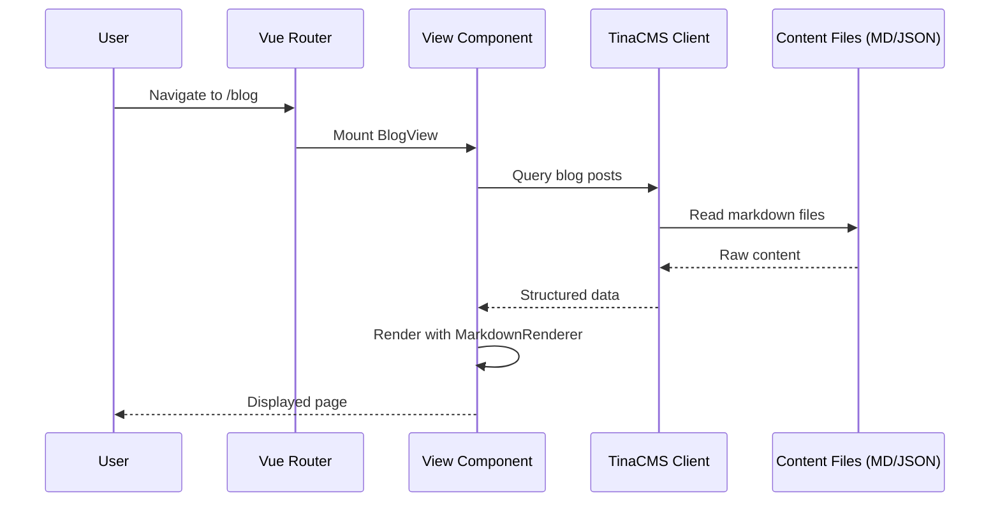

# Design Document: Handicraft Portfolio (C.Clakery)

## Overview

This design describes the architecture for the C.Clakery handicraft artist portfolio site, a Vue 3 + TypeScript + Vite single-page application. The site consists of five views (Home, Products, Blog, About Me, Contact) connected by a persistent navigation bar and footer. All content is managed through TinaCMS, a Git-backed headless CMS that stores content as markdown/JSON files in the repository.

The existing codebase already provides a `TopHeader.vue` hero component, a `ProductCatalog.vue` carousel/grid component, and an `OrderButton.vue` component. The design extends this foundation with Vue Router for client-side routing, a markdown rendering pipeline for blog posts, a contact form with email submission (recipient configured via environment variable), and TinaCMS integration for content management.

### Key Design Decisions

1. **Vue Router** for client-side routing — the standard choice for Vue 3 SPAs, enabling navigation without full page reloads.
2. **marked** (or similar lightweight library) for markdown-to-HTML conversion — small footprint, well-maintained, sufficient for blog content.
3. **TinaCMS** with local markdown/JSON content files — Git-backed content management that lets the artist edit content visually while keeping everything version-controlled.
4. **CSS media queries with mobile-first approach** — leveraging the existing responsive patterns already in `TopHeader.vue` and `ProductCatalog.vue`.
5. **fast-check** for property-based testing — mature PBT library for TypeScript/JavaScript with good Vue ecosystem compatibility.

## Architecture

The application follows a standard Vue 3 SPA architecture with a component-based structure, Vue Router for navigation, and TinaCMS as the content layer.



### Routing Structure

```mermaid
graph LR
    R[Vue Router] --> H[/ → HomeView]
    R --> P[/products → ProductsView]
    R --> B[/blog → BlogView]
    R --> BS[/blog/:slug → BlogPostView]
    R --> A[/about → AboutView]
    R --> C[/contact → ContactView]
    R --> X[/* → redirect to /]
```

### Data Flow

Content flows from TinaCMS-managed markdown/JSON files through the TinaCMS GraphQL client into Vue components. The build step (or runtime client) queries TinaCMS for content, which is then rendered by the appropriate view components.



## Components and Interfaces

### Layout Components

#### NavigationBar (`src/components/NavigationBar.vue`)

Persistent top navigation displayed on every view.

```typescript
// Props: none (self-contained)
// Internal state:
interface NavigationBarState {
  isMobileMenuOpen: boolean
}

// Navigation links (hardcoded routes):
const navLinks = [
  { label: 'Home', to: '/' },
  { label: 'Products', to: '/products' },
  { label: 'Blog', to: '/blog' },
  { label: 'About Me', to: '/about' },
  { label: 'Contact', to: '/contact' },
]
```

- Uses `<router-link>` for navigation with `active-class` for current route highlighting.
- Collapses to hamburger menu below 768px via CSS media query.
- Hamburger toggle controls `isMobileMenuOpen` state.

#### FooterComponent (`src/components/FooterComponent.vue`)

Persistent footer displayed on every view.

```typescript
interface FooterProps {
  artistName: string
  instagramUrl: string
}
// Displays current year via `new Date().getFullYear()`
// Instagram link opens in new tab via `target="_blank" rel="noopener noreferrer"`
```

### View Components

#### HomeView (`src/views/HomeView.vue`)

Landing page combining the existing `TopHeader` hero with a blog preview section.

```typescript
interface HomeViewData {
  hero: {
    logoSrc: string
    title: string
    shortDesc: string
    backgroundImageSrc: string
    orderButtonHref: string
  }
  recentPosts: BlogPostSummary[]  // 3 most recent
}

interface BlogPostSummary {
  slug: string
  title: string
  excerpt: string
  date: string
}
```

- Reuses existing `TopHeader.vue` component for the hero section.
- Blog preview section shows the 3 most recent posts with title and excerpt.
- Each preview item links to `/blog/:slug`.

#### ProductsView (`src/views/ProductsView.vue`)

Product catalog page.

```typescript
interface Product {
  imageSrc: string
  name: string
  description: string
  price: string
  orderUrl: string
}
```

- Extends the existing `ProductCatalog.vue` to include price display and per-product order URLs.
- Responsive grid: 3 columns > 900px, 2 columns 600–900px, 1 column < 600px (already implemented in `ProductCatalog.vue`).

#### BlogView (`src/views/BlogView.vue`)

Blog listing and individual post display.

```typescript
interface BlogPost {
  slug: string
  title: string
  date: string
  body: string  // markdown content
}
```

- Lists all posts sorted by date descending.
- Each entry shows title and publication date.
- Clicking navigates to `/blog/:slug` which renders the full post via `MarkdownRenderer`.

#### AboutView (`src/views/AboutView.vue`)

Artist information page.

```typescript
interface AboutData {
  images: Array<{ src: string; alt: string }>
  description: string  // markdown or plain text
}
```

#### ContactView (`src/views/ContactView.vue`)

Contact form page.

```typescript
interface ContactFormData {
  name: string
  email: string
  message: string
}

interface ContactFormState {
  formData: ContactFormData
  errors: Partial<Record<keyof ContactFormData, string>>
  submitStatus: 'idle' | 'sending' | 'success' | 'error'
  errorMessage: string
}
```

- Validates all fields are non-empty on submit.
- Validates email format with a regex pattern.
- Reads recipient email from `import.meta.env.VITE_RECIPIENT_EMAIL` environment variable.
- Sends form data to a configured email endpoint.
- Displays success/error feedback after submission.

### Utility Components

#### MarkdownRenderer (`src/components/MarkdownRenderer.vue`)

Converts markdown to styled HTML.

```typescript
interface MarkdownRendererProps {
  content: string  // raw markdown
}
```

- Uses `marked` library to parse markdown to HTML.
- Supports headings, paragraphs, bold, italic, links, images, lists, and code blocks.
- Applies site theme styling (Bitter font, brown/cream palette).
- Renders via `v-html` with sanitized output.

### Router Configuration (`src/router/index.ts`)

```typescript
const routes = [
  { path: '/', name: 'home', component: HomeView },
  { path: '/products', name: 'products', component: ProductsView },
  { path: '/blog', name: 'blog', component: BlogView },
  { path: '/blog/:slug', name: 'blog-post', component: BlogPostView },
  { path: '/about', name: 'about', component: AboutView },
  { path: '/contact', name: 'contact', component: ContactView },
  { path: '/:pathMatch(.*)*', redirect: '/' },
]
```

## Data Models

### TinaCMS Collections

TinaCMS content is stored as markdown or JSON files in the repository under a `content/` directory.

#### Home Page Collection (`content/home/index.md`)

```yaml
---
title: "C.Clakery"
shortDesc: "-where clay meets bakery-"
logoSrc: "/images/logo.png"
backgroundImageSrc: "/images/hero-bg.jpg"
orderButtonHref: "https://example.com/order"
---
```

#### Products Collection (`content/products/*.md`)

```yaml
---
name: "Product Name"
description: "Short description"
price: "€25.00"
imageSrc: "/images/products/product-1.jpg"
orderUrl: "https://example.com/order/product-1"
---
```

#### Blog Posts Collection (`content/blog/*.md`)

```yaml
---
title: "Post Title"
date: "2025-01-15"
---
Markdown body content here...
```

#### About Collection (`content/about/index.md`)

```yaml
---
images:
  - src: "/images/about/artist-1.jpg"
    alt: "Artist at work"
description: "About the artist..."
---
```

#### Footer Settings (`content/footer/index.json`)

```json
{
  "artistName": "C.Clakery",
  "instagramUrl": "https://instagram.com/c.clakery"
}
```

### TinaCMS Schema (`tina/config.ts`)

The TinaCMS configuration defines collections that map to the content files above (Home, Products, Blog, About, Footer). Each collection specifies the fields, their types, and the content directory path. This schema drives both the admin editing UI and the GraphQL API used by the Vue components to fetch content.

```typescript
import { defineConfig } from 'tinacms'

export default defineConfig({
  branch: 'main',
  clientId: '<tina-client-id>',
  token: '<tina-token>',
  build: { outputFolder: 'admin', publicFolder: 'public' },
  media: { tina: { mediaRoot: 'images', publicFolder: 'public' } },
  schema: {
    collections: [
      {
        name: 'home',
        label: 'Home Page',
        path: 'content/home',
        format: 'md',
        fields: [
          { type: 'string', name: 'title', label: 'Title' },
          { type: 'string', name: 'shortDesc', label: 'Short Description' },
          { type: 'image', name: 'logoSrc', label: 'Logo' },
          { type: 'image', name: 'backgroundImageSrc', label: 'Background Image' },
          { type: 'string', name: 'orderButtonHref', label: 'Order Button URL' },
        ],
      },
      {
        name: 'product',
        label: 'Products',
        path: 'content/products',
        format: 'md',
        fields: [
          { type: 'string', name: 'name', label: 'Name' },
          { type: 'string', name: 'description', label: 'Description' },
          { type: 'string', name: 'price', label: 'Price' },
          { type: 'image', name: 'imageSrc', label: 'Image' },
          { type: 'string', name: 'orderUrl', label: 'Order URL' },
        ],
      },
      {
        name: 'blog',
        label: 'Blog Posts',
        path: 'content/blog',
        format: 'md',
        fields: [
          { type: 'string', name: 'title', label: 'Title' },
          { type: 'datetime', name: 'date', label: 'Date' },
          { type: 'rich-text', name: 'body', label: 'Body', isBody: true },
        ],
      },
      {
        name: 'about',
        label: 'About Me',
        path: 'content/about',
        format: 'md',
        fields: [
          { type: 'object', name: 'images', label: 'Images', list: true, fields: [
            { type: 'image', name: 'src', label: 'Image' },
            { type: 'string', name: 'alt', label: 'Alt Text' },
          ]},
          { type: 'rich-text', name: 'description', label: 'Description', isBody: true },
        ],
      },
      {
        name: 'footer',
        label: 'Footer Settings',
        path: 'content/footer',
        format: 'json',
        fields: [
          { type: 'string', name: 'artistName', label: 'Artist Name' },
          { type: 'string', name: 'instagramUrl', label: 'Instagram URL' },
        ],
      },
    ],
  },
})
```


## Correctness Properties

*A property is a characteristic or behavior that should hold true across all valid executions of a system — essentially, a formal statement about what the system should do. Properties serve as the bridge between human-readable specifications and machine-verifiable correctness guarantees.*

### Property 1: Active navigation link matches current route

*For any* valid route in the application, when that route is active, the NavigationBar should apply the active CSS class to exactly the link corresponding to that route and no other links.

**Validates: Requirements 1.4**

### Property 2: Blog preview selects the three most recent posts

*For any* list of blog posts with distinct dates, the Home_View blog preview section should display exactly the 3 posts with the most recent dates, in descending date order.

**Validates: Requirements 2.3**

### Property 3: Blog post link points to correct slug route

*For any* blog post with a given slug, any link to that post (in the blog preview or blog list) should have its href set to `/blog/{slug}`.

**Validates: Requirements 2.4, 4.3, 10.4**

### Property 4: Product card renders all required fields

*For any* product with an image, name, description, price, and order URL, the rendered Product_Card should contain all five pieces of information including an Order Now button.

**Validates: Requirements 3.2, 3.3**

### Property 5: Order button links to the product's order URL

*For any* product with an order URL, the Order Now button's href attribute should exactly match that product's order URL.

**Validates: Requirements 3.4**

### Property 6: Product grid column count follows breakpoint rules

*For any* screen width value, the product grid column count should be 3 when width > 900px, 2 when 600px ≤ width ≤ 900px, and 1 when width < 600px.

**Validates: Requirements 3.5, 11.4**

### Property 7: Blog posts are sorted by date in descending order

*For any* list of blog posts, the Blog_View should display them such that each post's date is greater than or equal to the date of the post that follows it.

**Validates: Requirements 4.1**

### Property 8: Blog list entry displays title and date

*For any* blog post with a title and date, the rendered blog list entry should contain both the post title and the formatted publication date.

**Validates: Requirements 4.2**

### Property 9: Markdown elements render to correct HTML tags

*For any* markdown string containing headings, bold, italic, links, lists, or code blocks, the MarkdownRenderer output should contain the corresponding HTML elements (h1-h6, strong, em, a, ul/ol/li, pre/code).

**Validates: Requirements 5.1**

### Property 10: Markdown text round-trip preservation

*For any* valid markdown string, rendering it to HTML and then extracting the text content should preserve the original text content (ignoring markup syntax characters).

**Validates: Requirements 5.3**

### Property 11: Contact form validation flags invalid fields

*For any* combination of form field values, the contact form validation should return errors for exactly the fields that are invalid: empty name, empty email, empty message, or email not matching a valid email format.

**Validates: Requirements 7.4, 7.5**

### Property 12: Valid form submission triggers email send

*For any* form data with a non-empty name, a valid email address, and a non-empty message, submitting the contact form should invoke the email sending function with that data.

**Validates: Requirements 7.3**

### Property 13: Footer renders provided content

*For any* artist name and Instagram URL, the rendered FooterComponent should contain both the artist name text and a link with the Instagram URL.

**Validates: Requirements 8.3, 8.4**

### Property 14: Undefined routes redirect to home

*For any* URL path that does not match a defined route (/, /products, /blog, /blog/:slug, /about, /contact), the router should redirect to the home route (/).

**Validates: Requirements 10.3**

### Property 15: Navigation bar enters hamburger mode below 768px

*For any* screen width value, the NavigationBar should be in hamburger/mobile mode if and only if the width is below 768px.

**Validates: Requirements 11.2**

## Error Handling

### Contact Form Errors

- **Empty field validation**: Each field (name, email, message) is validated independently. Error messages are displayed inline next to the corresponding field. The form is not submitted until all validations pass.
- **Invalid email format**: A regex-based check (`/^[^\s@]+@[^\s@]+\.[^\s@]+$/`) validates email format before submission. An inline error is shown if the format is invalid.
- **Email send failure**: If the email API call fails (network error, server error), the form displays a user-friendly error message ("Message could not be sent. Please try again later.") and keeps the form data intact so the user can retry.
- **Email send success**: On success, the form displays a confirmation message and resets the form fields.

### Content Loading Errors

- **TinaCMS query failure**: If a TinaCMS content query fails, the component should display a fallback message ("Content is currently unavailable") rather than crashing. Use Vue's `onErrorCaptured` or try/catch in async setup.
- **Missing content fields**: Components should use optional chaining and default values for all CMS-sourced data to handle partially populated content gracefully.
- **Missing images**: Image components should use a placeholder or hide gracefully when `src` is empty or the image fails to load (use `@error` handler on `` tags).

### Routing Errors

- **Undefined routes**: The catch-all route `/:pathMatch(.*)*` redirects to `/`, ensuring visitors never see a blank page.
- **Invalid blog slug**: If a blog post slug doesn't match any content, the BlogPostView should display a "Post not found" message and offer navigation back to the blog list.

### Markdown Rendering Errors

- **Invalid markdown**: The `marked` library handles malformed markdown gracefully by treating unrecognized syntax as plain text. No additional error handling needed.
- **XSS prevention**: HTML output from markdown rendering should be sanitized (using DOMPurify or similar) before being injected via `v-html` to prevent cross-site scripting attacks.

## Testing Strategy

### Testing Framework

- **Unit/Component tests**: Vitest + Vue Test Utils
- **Property-based tests**: fast-check (with Vitest as the test runner)
- **Minimum iterations**: Each property-based test must run at least 100 iterations

### Unit Tests

Unit tests cover specific examples, edge cases, and integration points:

- **NavigationBar**: Renders all 5 links; hamburger menu toggles on click; active class applied for specific routes
- **FooterComponent**: Displays current year; Instagram link has `target="_blank"`
- **HomeView**: Renders TopHeader with correct props; blog preview section exists
- **ProductsView**: Renders product grid; empty product list shows appropriate state
- **BlogView**: Empty blog list state; single post rendering
- **ContactView**: Form renders all fields and send button; success message after send; error message on failure
- **MarkdownRenderer**: Specific markdown examples render correctly (e.g., `# Hello` → `<h1>Hello</h1>`)
- **Router**: Specific routes resolve to correct components; `/unknown` redirects to `/`
- **AboutView**: Renders images and description text

### Property-Based Tests

Each property test references its design document property and uses fast-check for input generation.

Tag format: **Feature: handicraft-portfolio, Property {number}: {property_text}**

| Property | Test Description | Generator Strategy |
|----------|-----------------|-------------------|
| 1 | Active nav link | Generate random route from defined routes, verify active class |
| 2 | Blog preview selection | Generate lists of 0–20 blog posts with random dates, verify top 3 selected |
| 3 | Blog post link correctness | Generate random slug strings, verify link href |
| 4 | Product card fields | Generate random product objects, verify all fields rendered |
| 5 | Order button URL | Generate random product objects with URLs, verify button href |
| 6 | Column count breakpoints | Generate random widths 200–2500, verify column count |
| 7 | Blog sort order | Generate random blog post lists, verify descending date order |
| 8 | Blog entry display | Generate random blog posts, verify title and date in output |
| 9 | Markdown element rendering | Generate markdown with random combinations of elements, verify HTML tags |
| 10 | Markdown text round-trip | Generate random text strings, wrap in markdown, render, extract text, compare |
| 11 | Contact form validation | Generate random form data (some valid, some empty/invalid), verify error flags |
| 12 | Valid form submission | Generate valid form data (non-empty fields, valid email), verify send called |
| 13 | Footer content | Generate random artist names and URLs, verify rendered output |
| 14 | Undefined route redirect | Generate random URL paths not matching defined routes, verify redirect |
| 15 | Hamburger mode | Generate random widths 200–2500, verify mobile mode flag |

### Test Organization

```
src/
  __tests__/
    components/
      NavigationBar.spec.ts      # Unit + Property 1, 15
      FooterComponent.spec.ts    # Unit + Property 13
      MarkdownRenderer.spec.ts   # Unit + Property 9, 10
      ProductCard.spec.ts        # Unit + Property 4, 5
    views/
      HomeView.spec.ts           # Unit + Property 2
      ProductsView.spec.ts       # Unit + Property 6
      BlogView.spec.ts           # Unit + Property 3, 7, 8
      ContactView.spec.ts        # Unit + Property 11, 12
    router/
      router.spec.ts             # Unit + Property 14
```
