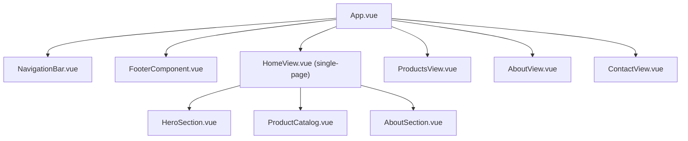
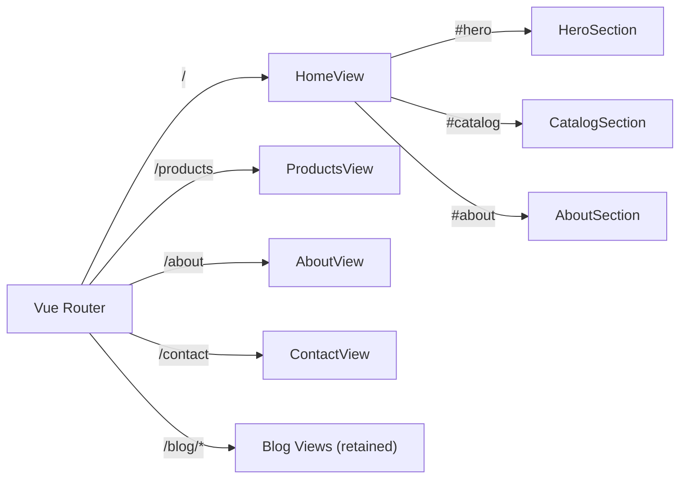

# Design Document: Site Makeover

## Overview

This design covers the complete visual and structural makeover of the c.clakery Vue 3 + TinaCMS website to match the HTML reference design at #[[file:refrerence/c-clakery-website.html]]. The final implementation must be pixel-perfect to this reference — all CSS values, animations, colors, fonts, spacing, and layout details are derived directly from it. The site transitions from a multi-page portfolio layout to a modern single-page-style design with a full-screen hero (featuring animated floating blobs and split-color brand styling), an image-based product catalog grid (with emoji fallback and per-product gradient backgrounds), a two-column about-the-maker section, and a rich four-section footer. All content remains CMS-editable through TinaCMS.

The key changes are:
- Replace the image-based `TopHeader` hero with a full-viewport hero section featuring animated background blobs, split-color brand name ("c." dark brown + "clakery" terracotta italic), tagline, description, CTA button with arrow SVG, scroll indicator, and fadeUp entrance animation
- Replace image-based product cards with cards that display emojis on unique per-product gradient backgrounds, support optional badges with frosted glass effect, and animate in with staggered fadeUpCard delays
- Consolidate Hero, Product Catalog, and About sections onto the home page as a single scrollable view
- Redesign the navigation bar with split-color logo, animated link underlines, fadeDown entrance animation, and fixed positioning with backdrop blur
- Redesign the about section as a two-column grid with decorative background circles, inner-bordered emoji avatar, two bio paragraphs, divider line, and styled quote
- Redesign the footer into a four-section layout: Brand, Navigate, Connect, Follow Along
- Update TinaCMS schemas and content files to support new fields (bgGradient, emoji, badge, two bio paragraphs, etc.)
- Switch fonts to Outfit (body) + DM Serif Display (headings) and update color palette to exact reference values
- Remove Blog from main navigation (retain routes for backward compatibility)

## Architecture

The existing architecture remains: Vue 3 + Vite + Vue Router + TinaCMS with a content layer (`src/content/index.ts`) that parses markdown/JSON frontmatter via Vite glob imports. No new architectural patterns are introduced.

### High-Level Component Layout



### Routing Strategy

The home page (`/`) renders all three sections (Hero, Catalog, About) as a single scrollable view. Navigation links for Home, Catalog, About use hash-based smooth scrolling (`#hero`, `#catalog`, `#about`). Separate routes (`/products`, `/about`, `/contact`) are retained for direct URL access. Blog routes remain for backward compatibility but are removed from navigation.



## Components and Interfaces

### New Components

#### HeroSection.vue
Replaces `TopHeader.vue` on the home page. Full-viewport hero with animated background blobs, split-color brand name, arrow SVG in CTA, and fadeUp entrance animation.

```typescript
// Props
interface HeroSectionProps {
  brandName: string       // e.g. "c.clakery"
  tagline: string         // e.g. "Where Clay Meets Bakery"
  description: string     // paragraph about the brand
  ctaLabel: string        // e.g. "Explore Collection"
}

// Emits
interface HeroSectionEmits {
  (e: 'cta-click'): void  // emitted when CTA button is clicked
}
```

Visual details:
- Background: `linear-gradient(160deg, var(--off-white) 0%, var(--beige) 50%, var(--blush) 100%)`
- Three animated blob shapes in `.hero-bg-shapes` container:
  - `.blob-1`: 500px circle, `var(--blush)`, positioned top: -100px, right: -100px, `floatBlob 12s ease-in-out infinite`, opacity: 0.25
  - `.blob-2`: 350px circle, `var(--beige-dark)`, positioned bottom: -50px, left: -80px, `floatBlob 10s ease-in-out infinite reverse`, opacity: 0.25
  - `.blob-3`: 200px circle, `var(--sage)`, positioned top: 30%, left: 10%, `floatBlob 14s ease-in-out infinite 2s`, opacity: 0.25
- `@keyframes floatBlob`: 0%/100% translate(0,0) scale(1) → 33% translate(20px,-30px) scale(1.05) → 66% translate(-15px,20px) scale(0.95)
- Brand name split rendering: `c.<span class="accent">clakery</span>` — "c." in `var(--dark-brown)`, ".accent" in `var(--terracotta)` with `font-style: italic`
- Hero title: DM Serif Display, 86px, font-weight 400, letter-spacing -1px
- Tagline: DM Serif Display, 20px, italic, `var(--terracotta-light)`
- Description: Outfit, 15px, `var(--soft-brown)`, font-weight 300, max-width 440px, line-height 1.7
- CTA button: dark-brown background, cream text, 50px border-radius (pill), 13px uppercase, letter-spacing 1.5px, inline-flex with gap 10px for arrow SVG
- CTA arrow SVG: `<svg width="16" height="16" viewBox="0 0 24 24" fill="none" stroke="currentColor" stroke-width="2" stroke-linecap="round" stroke-linejoin="round"><path d="M5 12h14M12 5l7 7-7 7"/></svg>`
- CTA hover: background → terracotta, translateY(-2px), enhanced box-shadow, SVG translateX(3px)
- Hero content: `@keyframes fadeUp` from opacity:0 translateY(40px) to opacity:1 translateY(0), 1s ease-out, 0.3s delay
- Scroll indicator: "Scroll" text + down-arrow SVG, `@keyframes bounce` with translateY(8px), 2s infinite, positioned absolute bottom 40px center

#### AboutSection.vue
New component for the about-the-maker section on the home page. Two-column grid layout with decorative elements. Distinct from the existing `AboutView.vue` which serves the `/about` route.

```typescript
// Props
interface AboutSectionProps {
  makerEmoji: string   // e.g. "👩‍🎨"
  bio: string          // bio text (two paragraphs separated by \n\n)
  quote: string        // maker quote text
}
```

Visual details:
- Section background: `var(--beige)`, padding 120px 60px, position relative, overflow hidden
- Two decorative background circles:
  - `.about-deco`: 300px × 300px circle, `rgba(192, 139, 92, 0.08)`, positioned top: -100px, right: -60px
  - `.about-deco-2`: 180px × 180px circle, `rgba(197, 206, 186, 0.15)`, positioned bottom: -40px, left: -40px
- Inner grid: `grid-template-columns: 1fr 1fr`, gap: 80px, max-width: 1100px, centered, align-items: center
- Left column — maker image:
  - `.about-image`: aspect-ratio 4/5, `linear-gradient(145deg, var(--blush), var(--beige-dark))`, border-radius 24px, centered emoji at 80px font-size
  - Inner border via `::before` pseudo-element: `inset: 8px`, `border: 1px solid rgba(255,255,255,0.4)`, border-radius 18px
- Right column — text content:
  - Section label: "Nice to meet you" — 11px, letter-spacing 3px, uppercase, `var(--terracotta)`, font-weight 500
  - Heading: "The Maker Behind" + line break + `<em>c.clakery</em>` — DM Serif Display, 40px, `var(--dark-brown)`, `<em>` in `var(--terracotta)` italic
  - Two `<p class="about-body">` paragraphs: 15px, line-height 1.8, `var(--soft-brown)`, font-weight 300, margin-bottom 20px each
  - `.about-divider`: 50px wide, 2px tall, `var(--terracotta-light)`, border-radius 2px, margin-bottom 20px
  - `.about-quote`: DM Serif Display italic, 17px, `var(--terracotta)`, padding-left 20px, border-left 2px solid `var(--terracotta-light)`
- Responsive: grid stacks to single column on mobile

### Modified Components

#### NavigationBar.vue
- Change nav links to: Home, Catalog, About, Contact
- Remove Blog link
- Change from `sticky` to `fixed` positioning with `z-index: 100`
- Logo: `c.<span>clakery</span>` — DM Serif Display, 22px, "c." in `var(--dark-brown)`, `<span>` in `var(--terracotta)`, letter-spacing 0.5px
- Background: `rgba(251, 247, 240, 0.85)` with `backdrop-filter: blur(20px)` and `-webkit-backdrop-filter: blur(20px)`
- Border bottom: `1px solid rgba(196, 168, 130, 0.15)`
- Nav links: 14px, uppercase, letter-spacing 1.5px, `var(--soft-brown)`, font-weight 400
- Link hover underline: `::after` pseudo-element, absolute bottom -4px, height 1.5px, `var(--terracotta)`, width transitions from 0 to 100% on hover, border-radius 2px
- Entrance animation: `@keyframes fadeDown` from opacity:0 translateY(-20px) to opacity:1 translateY(0), 0.8s ease-out
- Home/Catalog/About links use smooth scroll to `#hero`/`#catalog`/`#about` when on home page, or navigate to `/#hero` etc. when on other pages
- Contact link navigates to `/contact` route
- Hamburger menu behavior unchanged (< 768px)

#### ProductCatalog.vue
Major refactor from carousel/slider to a static responsive grid with per-product gradient backgrounds, staggered animations, and decorative top line.

```typescript
// Updated Props
interface ProductCatalogProps {
  products: Array<{
    imageSrc: string     // TinaCMS image path (empty string if not set)
    emoji: string        // e.g. "🥐" — fallback when imageSrc is empty
    name: string
    description: string
    price: string        // e.g. "RM 18"
    badge?: string       // e.g. "Bestseller", "New", "Popular"
    bgGradient: string   // e.g. "linear-gradient(145deg, #F5E6D0, #EDCFB0)"
  }>
}
```

Visual details:
- Section: `var(--off-white)` background, padding 100px 60px 120px
- Decorative top line: `::before` pseudo-element, absolute top 0, centered, 60px wide, 3px tall, `linear-gradient(90deg, transparent, var(--terracotta-light), transparent)`, border-radius 2px
- Section header: centered, margin-bottom 60px
  - `.section-label`: 11px, letter-spacing 3px, uppercase, `var(--terracotta)`, font-weight 500, margin-bottom 14px
  - `.section-title`: DM Serif Display, 44px, `var(--dark-brown)`, font-weight 400, margin-bottom 12px
  - `.section-subtitle`: 15px, `var(--soft-brown)`, font-weight 300, max-width 400px, centered, line-height 1.6
- Grid: `grid-template-columns: repeat(3, 1fr)`, gap 30px, max-width 1100px, centered
- Product card: `var(--cream)` background, border-radius 20px, `border: 1px solid rgba(196, 168, 130, 0.12)`
- Card hover: `translateY(-6px)`, `box-shadow: 0 16px 40px rgba(92, 74, 50, 0.1)`, `border-color: rgba(192, 139, 92, 0.2)`
- Staggered entrance: `@keyframes fadeUpCard` from opacity:0 translateY(30px) to opacity:1 translateY(0), 0.6s ease-out forwards. Cards start with `opacity: 0`. nth-child delays: 0.1s, 0.2s, 0.3s, 0.4s, 0.5s, 0.6s
- Product image area: `aspect-ratio: 1`, overflow hidden. `.product-img-inner` uses the per-product `bgGradient` as inline style background, centered emoji at 56px
- Image hover: `.product-card:hover .product-img-inner { transform: scale(1.05); }` with 0.5s ease transition
- Badge: absolute top 14px left 14px, `rgba(255, 252, 247, 0.85)` background, `backdrop-filter: blur(8px)`, 50px border-radius, 10px font-size, 1.5px letter-spacing, uppercase, `var(--terracotta)`, font-weight 500
- Product info: padding 20px 22px 24px
  - Name: DM Serif Display, 18px, `var(--dark-brown)`
  - Description: 13px, `var(--warm-brown)`, font-weight 300
  - Price: 16px, font-weight 500, `var(--terracotta)`
- Per-product gradient backgrounds (stored in content as `bgGradient`):
  - Croissant: `linear-gradient(145deg, #F5E6D0, #EDCFB0)`
  - Brownie: `linear-gradient(145deg, #E8D5C0, #D4B896)`
  - Cake: `linear-gradient(145deg, #F2DDD0, #E8C7B5)`
  - Donut: `linear-gradient(145deg, #F0E6D6, #E4D5C0)`
  - Cookie: `linear-gradient(145deg, #ECE0D0, #DDD0B8)`
  - Bread: `linear-gradient(145deg, #F5EAD8, #E8D8C0)`

#### FooterComponent.vue
Expand from simple one-line footer to four-section layout matching the reference.

```typescript
// Updated Props
interface FooterComponentProps {
  artistName: string
  instagramUrl: string
  email?: string          // e.g. "hello@cclakery.com"
  instagramHandle?: string // e.g. "@c.clakery"
}
```

Visual details:
- Footer: `var(--dark-brown)` background, `var(--beige)` text, padding 60px 60px 30px
- `.footer-inner`: max-width 1100px, centered
- `.footer-top`: flex, justify-content space-between, align-items flex-start, margin-bottom 50px
  - Left — `.footer-brand`:
    - `.footer-logo`: DM Serif Display, 28px, `var(--cream)`, with `<span>` in `var(--terracotta-light)` for "clakery"
    - `.footer-tagline`: 13px, `var(--warm-brown)`, italic, DM Serif Display
  - Center-right — `.footer-links-group`: flex with gap 80px, containing two `.footer-col` divs:
    - Navigate column: h4 heading (11px, letter-spacing 2.5px, uppercase, `var(--warm-brown)`, font-weight 500), ul with Home/Catalog/About links (14px, `var(--beige-dark)`, font-weight 300, hover → `var(--terracotta-light)`)
    - Connect column: h4 heading, ul with email and Instagram handle links
  - Far right — Follow Along section:
    - h4 heading "Follow Along" (same styling as other column headings)
    - `.footer-social`: flex with gap 12px
    - `.social-icon`: 40px × 40px circle, `rgba(255, 252, 247, 0.08)` background, `1px solid rgba(255, 252, 247, 0.12)` border, centered SVG icon (18px × 18px, fill `var(--beige)`)
    - `.social-icon:hover`: background → `var(--terracotta)`, border-color → `var(--terracotta)`, translateY(-2px)
    - `.social-icon.ig-highlight`: `rgba(192, 139, 92, 0.2)` background, `var(--terracotta-light)` border (highlighted Instagram icon)
    - Instagram SVG icon inline
- `.footer-bottom`: `border-top: 1px solid rgba(196, 168, 130, 0.15)`, padding-top 24px, flex space-between
  - Left: `.footer-copy` — 12px, `var(--warm-brown)`, font-weight 300, "© 2026 c.clakery. All rights reserved."
  - Right: `.footer-made` — 12px, `var(--warm-brown)`, font-weight 300, flex with gap 6px, "Crafted with 🤎 and a little bit of clay"
- Responsive: columns stack vertically on mobile

#### HomeView.vue
- Remove blog preview section
- Import and render HeroSection, ProductCatalog, AboutSection sequentially
- Fetch home content, products, and about content on mount
- Pass data to child components
- CTA click handler scrolls to `#catalog`

#### Content Layer (src/content/index.ts)
- Update `HomeContent` interface to add `description` and `ctaLabel` fields
- Update `Product` interface: replace `orderUrl` with `emoji`, `badge`, `bgGradient`, and retain `imageSrc` (now a TinaCMS image field)
- Add `AboutHomeContent` interface with `makerEmoji`, `bio` (string supporting two paragraphs via `\n\n`), `quote` fields
- Update `FooterSettings` interface to add `email` and `instagramHandle`
- Update `getHomeContent()`, `getProducts()`, `getAboutContent()`, `getFooterSettings()` to parse new fields

### Unchanged Components
- `ContactView.vue` — no changes needed
- `BlogView.vue`, `BlogPostView.vue` — retained for backward compatibility, no changes
- `MarkdownRenderer.vue` — retained, may be used in AboutSection
- `OrderButton.vue` — no longer used in product cards (removed from catalog), may be retained

## Data Models

### TinaCMS Schema Changes

#### Home Collection (updated)
```typescript
{
  name: 'home',
  label: 'Home Page',
  path: 'content/home',
  format: 'md',
  fields: [
    { type: 'string', name: 'title', label: 'Brand Name' },
    { type: 'string', name: 'shortDesc', label: 'Tagline' },
    { type: 'string', name: 'description', label: 'Hero Description', ui: { component: 'textarea' } },
    { type: 'string', name: 'ctaLabel', label: 'CTA Button Label' },
  ],
}
```

#### Product Collection (updated)
```typescript
{
  name: 'product',
  label: 'Products',
  path: 'content/products',
  format: 'md',
  fields: [
    { type: 'string', name: 'name', label: 'Name' },
    { type: 'string', name: 'description', label: 'Description' },
    { type: 'string', name: 'price', label: 'Price' },
    { type: 'image', name: 'imageSrc', label: 'Product Image' },
    { type: 'string', name: 'emoji', label: 'Emoji Fallback' },
    { type: 'string', name: 'badge', label: 'Badge Text' },
    { type: 'string', name: 'bgGradient', label: 'Background Gradient CSS' },
  ],
}
```

#### About Collection (updated)
```typescript
{
  name: 'about',
  label: 'About Me',
  path: 'content/about',
  format: 'md',
  fields: [
    { type: 'string', name: 'makerEmoji', label: 'Maker Emoji' },
    { type: 'string', name: 'bio', label: 'Bio', ui: { component: 'textarea' } },
    { type: 'string', name: 'quote', label: 'Quote' },
  ],
}
```

#### Footer Collection (updated)
```typescript
{
  name: 'footer',
  label: 'Footer Settings',
  path: 'content/footer',
  format: 'json',
  fields: [
    { type: 'string', name: 'artistName', label: 'Artist Name' },
    { type: 'string', name: 'instagramUrl', label: 'Instagram URL' },
    { type: 'string', name: 'email', label: 'Email Address' },
    { type: 'string', name: 'instagramHandle', label: 'Instagram Handle' },
  ],
}
```

### Content Layer TypeScript Interfaces

```typescript
// Updated interfaces in src/content/index.ts

export interface HomeContent {
  title: string          // brand name
  shortDesc: string      // tagline
  description: string    // hero description paragraph
  ctaLabel: string       // CTA button label
}

export interface Product {
  name: string
  description: string
  price: string
  imageSrc: string       // TinaCMS image path (empty string if not set)
  emoji: string          // fallback placeholder
  badge: string          // empty string if not set
  bgGradient: string     // per-product gradient CSS value
}

export interface AboutContent {
  makerEmoji: string
  bio: string            // two paragraphs separated by \n\n
  quote: string
}

export interface FooterSettings {
  artistName: string
  instagramUrl: string
  email: string
  instagramHandle: string
}
```

### Content File Structures

#### content/home/index.md
```yaml
---
title: c.clakery
shortDesc: Where Clay Meets Bakery
description: >-
  Tiny clay treats baked with love — croissants, brownies & all the sweetness,
  minus the calories. Handcrafted with care, each piece is a little celebration.
ctaLabel: Explore Collection
---
```

#### content/products/*.md (example: clay-croissant-charm.md)
```yaml
---
name: Clay Croissant Charm
description: Mini golden croissant pendant
price: RM 18
imageSrc: ""
emoji: "🥐"
badge: Bestseller
bgGradient: "linear-gradient(145deg, #F5E6D0, #EDCFB0)"
---
```

#### content/products/*.md (example: brownie-stack-magnet.md)
```yaml
---
name: Brownie Stack Magnet
description: Fudgy brownie fridge magnet
price: RM 15
imageSrc: ""
emoji: "🍫"
badge: New
bgGradient: "linear-gradient(145deg, #E8D5C0, #D4B896)"
---
```

#### content/about/index.md
```yaml
---
makerEmoji: "👩‍🎨"
bio: >-
  Hi there! I'm the baker-sculptor behind c.clakery — a tiny studio where polymer clay transforms into your favourite baked treats. Every croissant, brownie, and cookie is hand-rolled, textured, and painted to look good enough to eat (please don't!).

  What started as a weekend hobby quickly became a sweet obsession. Each piece takes hours of patient sculpting, and I love knowing they bring little moments of joy to your everyday carry.
quote: >-
  Every tiny treat is a love letter to the art of making things by hand.
---
```

#### content/footer/index.json
```json
{
  "artistName": "c.clakery",
  "instagramUrl": "https://instagram.com/c.clakery",
  "email": "hello@cclakery.com",
  "instagramHandle": "@c.clakery"
}
```

### CSS Variables (updated base.css)

```css
:root {
  /* Exact color palette from reference */
  --cream: #FBF7F0;
  --beige: #F0E6D6;
  --beige-dark: #E4D5C0;
  --warm-brown: #C4A882;
  --terracotta-light: #D4A574;
  --terracotta: #C08B5C;
  --soft-brown: #8B7355;
  --dark-brown: #5C4A32;
  --off-white: #FFFCF7;
  --blush: #F2DDD0;
  --sage: #C5CEBA;

  --font-body: 'Outfit', sans-serif;
  --font-heading: 'DM Serif Display', serif;

  --radius-card: 20px;
  --radius-button: 50px;
}
```

Google Fonts import URL: `https://fonts.googleapis.com/css2?family=DM+Serif+Display:ital@0;1&family=Outfit:wght@300;400;500;600&display=swap`

### CSS Animations

```css
@keyframes fadeDown {
  from { opacity: 0; transform: translateY(-20px); }
  to { opacity: 1; transform: translateY(0); }
}

@keyframes fadeUp {
  from { opacity: 0; transform: translateY(40px); }
  to { opacity: 1; transform: translateY(0); }
}

@keyframes fadeUpCard {
  from { opacity: 0; transform: translateY(30px); }
  to { opacity: 1; transform: translateY(0); }
}

@keyframes floatBlob {
  0%, 100% { transform: translate(0, 0) scale(1); }
  33% { transform: translate(20px, -30px) scale(1.05); }
  66% { transform: translate(-15px, 20px) scale(0.95); }
}

@keyframes bounce {
  0%, 100% { transform: translateX(-50%) translateY(0); }
  50% { transform: translateX(-50%) translateY(8px); }
}
```

## Correctness Properties

*A property is a characteristic or behavior that should hold true across all valid executions of a system — essentially, a formal statement about what the system should do. Properties serve as the bridge between human-readable specifications and machine-verifiable correctness guarantees.*

### Property 1: Home content frontmatter round-trip

*For any* valid home content frontmatter containing title, shortDesc, description, and ctaLabel fields, parsing the frontmatter via the content layer and reading back those fields should produce the same values that were written.

**Validates: Requirements 1.12, 7.6**

### Property 2: Product content frontmatter round-trip

*For any* valid product frontmatter containing name, description, price, imageSrc, emoji, bgGradient, and optionally badge fields, parsing the frontmatter via the content layer should produce a Product object with matching field values. When badge is omitted, the parsed value should be an empty string. When imageSrc is omitted, the parsed value should be an empty string. When bgGradient is omitted, the parsed value should be a default gradient.

**Validates: Requirements 3.11, 4.6, 4.7, 4.8, 4.9**

### Property 3: Product card renders all product data fields

*For any* product with a name, description, price, bgGradient, and either an imageSrc or emoji, rendering a product card with that data should produce output containing the name, description, and price. When imageSrc is non-empty, the output should contain an img element with that source. When imageSrc is empty and emoji is non-empty, the output should contain the emoji text. The bgGradient should be applied as an inline style on the image area.

**Validates: Requirements 3.4, 3.5, 3.6**

### Property 4: Product card badge conditional rendering

*For any* product, if the badge field is a non-empty string, the rendered product card should contain the badge text. If the badge field is empty, the rendered product card should not contain a badge element.

**Validates: Requirements 3.7**

### Property 5: About content frontmatter round-trip

*For any* valid about content frontmatter containing makerEmoji, bio, and quote fields, parsing the frontmatter via the content layer should produce an AboutContent object with matching field values.

**Validates: Requirements 5.8, 7.6**

### Property 6: Footer JSON round-trip

*For any* valid footer JSON containing artistName, instagramUrl, email, and instagramHandle fields, parsing the JSON via the content layer should produce a FooterSettings object with matching field values.

**Validates: Requirements 6.9**

## Error Handling

### Content Loading Failures
- All content-fetching functions already use try/catch with fallback defaults. This pattern is retained.
- `HomeView.vue` sets a `contentUnavailable` flag and displays a message if content loading fails.
- Each section component receives data via props, so a failure in one content source does not block other sections from rendering.

### Missing or Malformed Content Fields
- The content layer uses nullish coalescing (`??`) to default missing fields to empty strings.
- Missing `badge` field on products defaults to `''` (empty string), and the UI conditionally hides the badge element.
- Missing `imageSrc` field on products defaults to `''` (empty string), and the card falls back to displaying the emoji.
- Missing `emoji` field defaults to `''`, and the card renders without a visual placeholder if imageSrc is also empty.
- Missing `bgGradient` field defaults to `'linear-gradient(145deg, #F0E6D6, #E4D5C0)'` (beige default).
- Missing `description` or `ctaLabel` on home content defaults to empty strings; the hero section still renders with available data.
- Missing `bio` field defaults to empty string; the about section renders without bio paragraphs.

### Navigation Edge Cases
- When a user is on a non-home page and clicks a section link (e.g., Catalog), the nav should first route to `/` then scroll to the target section. This is handled by checking `route.path` before deciding between `scrollIntoView` and `router.push`.
- Hash-based scroll targets (`#hero`, `#catalog`, `#about`) gracefully no-op if the target element doesn't exist.

### Image/Asset Errors
- The existing `onImageError` pattern (hiding broken images) is retained where applicable.
- Product cards display a TinaCMS-managed image when `imageSrc` is set. If the image fails to load, the card falls back to displaying the emoji placeholder.
- When no `imageSrc` is set (empty string), the card renders the emoji directly without attempting an image load.

## Testing Strategy

### Unit Tests (Vitest + @vue/test-utils)

Unit tests cover specific examples, edge cases, and component rendering:

- **HeroSection rendering**: Verify that brand name (with split color spans), tagline, description, CTA button label with arrow SVG, scroll indicator, and blob elements are rendered with specific prop values.
- **NavigationBar links**: Verify that exactly Home, Catalog, About, Contact links are rendered and Blog is absent. Verify split-color logo rendering.
- **NavigationBar hamburger**: Verify hamburger button toggles mobile menu visibility.
- **ProductCatalog section headers**: Verify "Shop the sweetness" and "Our Collection" text is rendered. Verify decorative top line pseudo-element class exists.
- **ProductCatalog card animations**: Verify cards have staggered animation delay styles.
- **ProductCatalog image hover**: Verify product-img-inner has scale transition class.
- **AboutSection rendering**: Verify maker emoji in gradient container with inner border, heading text, two bio paragraphs, divider element, and quote are rendered with specific prop values. Verify decorative circle elements exist.
- **FooterComponent rendering**: Verify brand name with split color, tagline, Navigate links, Connect info, Follow Along section with social icons, copyright text, and "Crafted with 🤎" text are rendered. Verify four-section layout.
- **HomeView composition**: Verify that HeroSection, ProductCatalog, and AboutSection are all rendered on the home page.
- **Router configuration**: Verify routes exist for `/`, `/products`, `/about`, `/contact`.
- **Content file validation**: Verify 6 product files exist with required fields (including bgGradient), home content has description and ctaLabel, about content has makerEmoji/bio/quote, footer has email.
- **TinaCMS schema fields**: Verify product schema includes imageSrc (type: 'image'), emoji, badge, and bgGradient fields, home schema includes description and ctaLabel, about schema includes makerEmoji/bio/quote.

### Property-Based Tests (Vitest + fast-check)

Property-based tests verify universal properties across randomly generated inputs. The project already has `fast-check` as a dev dependency.

Each property test:
- Runs a minimum of 100 iterations
- References its design document property via a comment tag
- Uses `fast-check` arbitraries to generate random valid inputs

**Test implementations:**

1. **Feature: site-makeover, Property 1: Home content frontmatter round-trip**
   - Generate random strings for title, shortDesc, description, ctaLabel
   - Construct frontmatter string, parse with `parseFrontmatter`, verify fields match

2. **Feature: site-makeover, Property 2: Product content frontmatter round-trip**
   - Generate random strings for name, description, price, imageSrc, emoji, bgGradient, and optional badge
   - Construct frontmatter string, parse with content layer logic, verify fields match
   - When badge is omitted, verify parsed value is empty string
   - When imageSrc is omitted, verify parsed value is empty string
   - When bgGradient is omitted, verify parsed value is default gradient

3. **Feature: site-makeover, Property 3: Product card renders all product data fields**
   - Generate random product objects (imageSrc, emoji, name, description, price, bgGradient)
   - Mount ProductCatalog with generated data, verify rendered HTML contains name, description, price
   - When imageSrc is non-empty, verify an img element is rendered with that source
   - When imageSrc is empty and emoji is non-empty, verify the emoji text is rendered
   - Verify bgGradient is applied as inline style on image area

4. **Feature: site-makeover, Property 4: Product card badge conditional rendering**
   - Generate random products with and without badge values
   - Mount ProductCatalog, verify badge element presence matches non-empty badge field

5. **Feature: site-makeover, Property 5: About content frontmatter round-trip**
   - Generate random strings for makerEmoji, bio, quote
   - Construct frontmatter string, parse with content layer logic, verify fields match

6. **Feature: site-makeover, Property 6: Footer JSON round-trip**
   - Generate random strings for artistName, instagramUrl, email, instagramHandle
   - Construct JSON string, parse with content layer logic, verify fields match

### Test Configuration

- Test runner: Vitest (already configured in `vitest.config.ts`)
- Environment: jsdom (already configured)
- Component testing: `@vue/test-utils` (already a dev dependency)
- Property testing: `fast-check` (already a dev dependency)
- Minimum iterations per property test: 100
- Each property test tagged with: `Feature: site-makeover, Property {N}: {title}`
